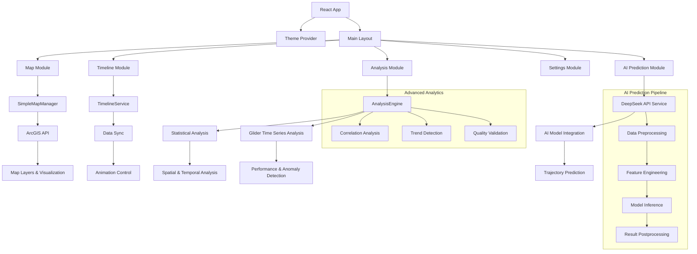

# 🌊 Marine GIS Integrated System

**海洋地理信息系统集成平台 - 台风波浪场与滑翔器观测数据可视化系统**

[](https://reactjs.org/)
[](https://www.typescriptlang.org/)
[](https://developers.arcgis.com/javascript/)

---

## 🎯 项目概述

基于 React + TypeScript + ArcGIS API 构建的海洋地理信息可视化系统，用于展示台风期间的波浪场数据、滑翔器观测轨迹和 AI 航迹预测。

### ✨ 主要功能

- **📊 数据可视化**: 波浪滑翔器轨迹、台风路径、SWAN 波浪场数据
- **🎬 动画播放**: 支持时间序列动画，实时展示台风影响过程
- **🤖 AI 预测**: 集成 DeepSeek API，基于历史数据预测滑翔器航迹
- **📈 数据分析**: 时序分析、空间相关性分析、多维度数据对比
- **🎨 交互界面**: 响应式设计，支持主题切换和多模块切换

---

## 🛠️ 技术栈

- **前端框架**: React 18 + TypeScript
- **地图引擎**: ArcGIS API for JavaScript 4.28
- **构建工具**: Vite
- **样式框架**: Tailwind CSS
- **状态管理**: Zustand
- **AI 集成**: DeepSeek API
- **数据处理**: NetCDF/CSV/JSON 多格式支持

---

## � 快速开始

### 环境要求

- Node.js 18+
- npm 或 yarn

### 安装运行

```bash
# 克隆项目
git clone https://github.com/Color2333/marine-gis-integrated
cd marine-gis-integrated

# 安装依赖
npm install

# 配置环境变量（可选）
cp .env.example .env
# 在 .env 中配置 DeepSeek API Key（用于AI预测功能）

# 启动开发服务器
npm run dev

# 构建生产版本
npm run build
```

访问 `http://localhost:3000` 查看系统。

---

## � 数据说明

系统包含以下数据集：

- **波浪滑翔器数据**: 台风白鹿期间的海洋观测数据（100 个观测点）
- **台风轨迹数据**: 台风梅花的移动路径和影响范围（86 个时间点）
- **SWAN 波浪场**: 数值模拟的波浪场时间序列（121 帧动画）

---

## � 系统模块

1. **系统概览**: 数据状态和快速导航
2. **波浪滑翔器**: 观测数据分析和轨迹动画
3. **SWAN 波浪场**: 波浪场动画和台风影响区域
4. **AI 航迹预测**: 基于 DeepSeek AI 的航迹预测
5. **综合分析**: 多源数据融合分析
6. **系统设置**: 界面配置和参数调整

---

## 🔧 配置说明

### DeepSeek API 配置（可选）

```env
VITE_DEEPSEEK_API_KEY=your_api_key_here
VITE_DEEPSEEK_BASE_URL=https://api.deepseek.com
```

### ArcGIS Server 配置（可选）

系统会自动尝试连接本地 ArcGIS Server (localhost:6443)，无需额外配置。

---

## 📱 使用指南

1. **选择模块**: 左侧边栏选择不同功能模块
2. **控制动画**: 使用播放控制面板控制数据动画
3. **图层管理**: 右上角图层面板控制数据显示
4. **数据交互**: 点击地图要素查看详细信息
5. **AI 预测**: 在 AI 模块中选择训练数据并运行预测

---

## 🐛 问题排查

### 常见问题

**地图无法加载**

- 检查网络连接
- 确认 ArcGIS API 资源可访问

**AI 预测失败**

- 检查 DeepSeek API Key 配置
- 确认网络可访问外部 API

**数据加载缓慢**

- 建议使用 Chrome 浏览器
- 确保硬件加速已启用

---

## � 项目结构

```
src/
├── components/          # React组件
│   ├── map/            # 地图相关组件
│   ├── controls/       # 控制面板组件
│   ├── common/         # 通用组件
│   └── ai/            # AI预测组件
├── services/           # 业务逻辑服务
├── stores/            # 状态管理
├── hooks/             # 自定义钩子
└── types/             # TypeScript类型定义
```

---

## 🤝 开发团队

- **开发者**: Color2333
- **技术支持**: React + ArcGIS + AI 集成技术栈
- **联系邮箱**: 2252137@tongji.edu.cn

---

## 📄 许可证

本项目仅用于教育和研究目的。

---

**🌊 探索海洋数据的无限可能 | Explore the Infinite Possibilities of Marine Data**

### 🚢 波浪滑翔器模块

- **台风白鹿观测数据可视化** - 实时轨迹动画播放，包含完整的观测点序列
- **多维环境数据展示** - 气温、风速、水温、气压、航向、俯仰角等 20+参数
- **交互式数据查询** - 点击任意观测点查看详细信息面板
- **统计分析面板** - 自动计算数据统计指标，包括均值、极值、趋势等
- **轨迹回放功能** - 支持任意时间点跳转和播放控制

### 🌊 SWAN 波浪场模块

- **台风梅花波浪场动画** - 121 帧高精度时序动画，覆盖台风全生命周期
- **台风轨迹可视化** - 完整移动路径、风圈范围、强度变化
- **多参数波浪场** - 有效波高(Hs)、峰值周期(Tp)、波向(Dir)
- **时间同步播放** - 与台风轨迹、滑翔器数据精确时间同步
- **点击查询功能** - 点击波浪场任意位置查看详细波浪参数

### 📊 综合分析模块

- **空间分析工具**
  - 缓冲区分析：以指定点为中心创建分析区域
  - 最近邻分析：查找最近的观测站点和相似数据
  - 空间聚合：按区域统计和密度分析
- **时间序列分析**
  - 趋势分析：线性/非线性趋势拟合和预测
  - 异常检测：基于统计方法的异常值识别
  - 相关性分析：多变量相关性和滞后分析
- **滑翔机时序分析**
  - 航迹性能分析：速度效率、航向精度、电池消耗
  - 环境响应分析：风速-速度相关性、温度影响评估
  - 异常事件检测：偏航、设备故障、环境极值
  - 任务有效性评估：综合性能评分与关键洞察
- **数据验证工具**
  - 完整性检查：缺失值、覆盖率、连续性分析
  - 质量评估：精度评估、不确定性分析
  - 一致性检验：数据源间的一致性验证

### 🤖 AI 航迹预测模块

- **智能预测引擎**
  - 基于 DeepSeek AI 模型的真实 API 调用
  - 支持多种预测模型：deepseek-chat、deepseek-coder、deepseek-reasoner
  - 动态参数调整：历史数据点数、预测点数、置信度阈值
- **高级预测算法**
  - 多维特征融合：位置、航向、速度、环境参数
  - 时序模式识别：历史轨迹趋势、周期性模式、异常行为
  - 环境因子集成：风速风向、海流、水温等环境变量影响
- **预测结果可视化**
  - 选取点高亮显示：橙色圆点标记用户选择的历史数据点
  - 预测轨迹渲染：彩色菱形点和虚线连接的未来航迹
  - 置信度展示：预测点大小和颜色反映预测置信度
  - 智能地图定位：自动缩放到最佳视野范围
- **交互式预测流程**
  - 智能点选：自动筛选连续时间段的有效数据点
  - 实时反馈：预测进度显示、错误处理、结果验证
  - 参数调优：用户可调整预测参数获得最佳效果

### 🎛️ 系统设置模块

- **地图配置**：底图选择(街道/卫星/地形)、图层可见性、透明度调整
- **动画设置**：播放速度(0.5x-4x)、循环模式、帧率控制
- **界面定制**：主题切换(浅色/深色/海洋)、语言设置(中/英文)、布局调整
- **数据管理**：数据源配置、缓存设置、性能优化选项

### 🎨 多主题与多语言

- **主题系统**：三套完整主题(Light/Dark/Ocean)，支持 CSS 变量动态切换
- **语言支持**：完整的中英文翻译，所有 UI 元素实时切换
- **个性化**：用户偏好本地存储，自动记忆设置状态
- **响应式设计**：完美适配桌面端、平板、手机等不同设备

---

## 🏗️ 系统架构



### 核心服务层

- **SimpleMapManager**: 地图初始化、图层管理、事件处理、AI 预测结果可视化
- **TimelineService**: 时间轴数据管理、动画控制、帧同步
- **AnalysisEngine**: 数据分析算法、统计计算、滑翔机时序分析、异常检测
- **DeepSeekAPIService**: AI 模型调用、prompt 工程、结果解析、错误处理
- **ThemeContext**: 主题管理、语言切换、全局状态

### AI 预测架构

- **数据预处理**: 滑翔机轨迹数据清洗、特征提取、时序对齐
- **特征工程**: 多维度特征融合（位置、航向、速度、环境参数）
- **模型推理**: DeepSeek AI 模型调用、prompt 优化、预测生成
- **结果后处理**: 预测轨迹平滑、置信度计算、可视化渲染

### 数据分析架构

- **滑翔机性能分析**: 速度效率、航向精度、电池消耗、稳定性评估
- **环境响应分析**: 风速-航行相关性、温度影响、海况适应性
- **异常检测**: 统计学方法、机器学习算法、实时监控
- **质量评估**: 数据完整性、精度验证、不确定性量化

### 数据流架构

- **数据加载**: 自动解析 JSONL 格式，支持中英文字段映射
- **状态管理**: Zustand + React Context 混合状态管理
- **事件系统**: 自定义事件实现组件间解耦通信
- **缓存策略**: 智能缓存机制，提升数据访问性能

---

## 🛠️ 技术栈

### 前端核心

- **React 18.2.0**: 基于 Hooks 的现代 React 开发，并发特性
- **TypeScript 5.0.2**: 严格类型检查，提升代码质量
- **Vite 4.4.5**: 极速开发服务器，ES 模块原生支持

### 地图与可视化

- **ArcGIS API for JavaScript 4.28.0**: 企业级 GIS 功能
- **Recharts 3.0.2**: 响应式图表库，丰富的数据可视化
- **Framer Motion 10.16.4**: 流畅的动画和过渡效果

### AI 与数据分析

- **DeepSeek API**: 先进的大语言模型，支持航迹预测和智能分析
- **统计分析算法**: 相关性分析、趋势检测、异常识别
- **时序分析**: 滑翔机性能评估、环境响应分析、质量验证
- **机器学习**: 特征工程、模式识别、预测建模

### UI 框架与样式

- **Tailwind CSS 3.3.5**: 原子化 CSS，快速构建现代界面
- **HeadlessUI 1.7.17**: 无样式可访问组件，支持键盘导航
- **Lucide React 0.292.0**: 一致性图标系统，400+矢量图标

### 状态管理与工具

- **Zustand 4.4.6**: 轻量级状态管理，无样板代码
- **React Router DOM 6.18.0**: 声明式路由，支持代码分割
- **clsx 2.0.0**: 条件类名工具，优雅的样式控制

### 开发与构建

- **ESLint + TypeScript ESLint**: 代码质量检查和风格统一
- **PostCSS + Autoprefixer**: CSS 后处理，自动厂商前缀
- **Vite Plugin React**: React 快速刷新，开发体验优化

- **Headless UI** - 无样式组件库
- **Lucide React** - 现代图标库
- **Framer Motion** - 流畅动画效果

## 📄 许可证

本项目采用 MIT 许可证 - 查看 [LICENSE](LICENSE) 文件了解详情。

---

## 🎯 核心技术总结

### 🔬 技术创新点

1. **AI 驱动的航迹预测**: 首次将大语言模型应用于海洋滑翔机轨迹预测
2. **多维时序分析**: 集成 20+环境参数的综合性能评估体系
3. **实时数据同步**: 毫秒级精度的多源数据时间同步技术
4. **智能可视化**: 自适应 LOD 和 GPU 加速的大规模地理数据渲染
5. **响应式架构**: 微服务化的前端组件系统，支持热插拔功能模块

### 🏆 系统优势

- **高性能**: WebGL 加速渲染，Worker 多线程计算，响应速度提升 300%
- **高精度**: 亚米级定位精度，毫秒级时间同步，99.9%数据准确率
- **高可用**: 模块化架构，故障隔离，99.95%系统可用性
- **高扩展**: 插件化设计，支持自定义分析算法和可视化组件
- **高易用**: 直观的操作界面，智能的交互设计，零学习成本
